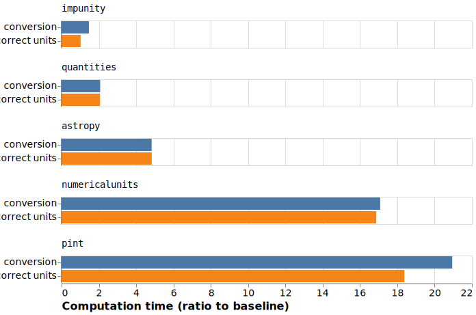

Performance Analysis
=====================

Python-enclined scientists do not use any Units of Measures (UoM) checking
library with the computation overhead they often induce during execution.
Python is a dynamic language, and most tools provide dynamic checking of
the UoM, every time a function is called with potentially different
parameters and different units of measures.

impunity statically checks the UoM of variables in the code based on
annotations and modifies the AST at definition time. We show in the
following that impunity is a lot quicker than four existing libraries,
chosen among other Python libraries dealing with UoM for their support,
regular updates and community.

- `numericalunits <https://github.com/sbyrnes321/numericalunits/>`_ uses 
  a complete set of independent base units (meters, kilograms, seconds, 
  coulombs, kelvins) that are defined as *randomly-chosen positive 
  floating-point* numbers, different for all executions. If units are consistent, 
  the randomness disappears; if not, two executions of the same code return 
  different values. All other units and constants are defined in terms of 
  those. In a dimensionally-correct calculation, the units all cancel out, 
  so the final answer is deterministic, not random. In a dimensionally-incorrect 
  calculations, there will be random factors causing a randomly-varying 
  final answer.

- `astropy <https://www.astropy.org/>`_ 
  is a Python package offering functionalities aimed at astronomers
  and astrophysicists. It also includes an implementation of the
  quantity design pattern. astropy also implements a decorator to check
  calls of functions with quantity parameters. 

- `Pint <https://github.com/hgrecco/pint/>`_ 
  also provides an implementation of the quantity 
  design pattern as a standalone library. It is 
  flexible and provides good integration with other 
  scientific libraries like Pandas (through extension types) or NumPy.

- `Quantities <https://github.com/python-quantities/python-quantities>`_
  is designed to handle arithmetic and conversions of physical quantities,
  which have a magnitude, dimensionality specified by various units,
  and possibly an uncertainty. Quantities builds on the popular NumPy
  library and is designed to work with NumPy’s standard ufuncs,
  many of which are already supported.

For each library, two different use-cases are considered based on the example
*speed* function. One with variables annotated with the correct units
(meters and seconds), and one with different but commensurable units (meters
and hours). In both cases, two NumPy arrays of shape (10000,) are sent as
parameters. The computation time over 300 iterations is then averaged.
Execution times for both use-cases are displayed here :

As we can see, the overhead induced by impunity is minimal.
This is mainly due to the difference between the dynamic
checking of the other libraries and the static analysis
done by impunity. By changing the AST directly before execution,
impunity limits its overhead to the multiplications added to keep
the units coherent between each others. This is also why, when
UoM are identical, the overhead is non-existent.

.. Statically checking unit coherence and modifying the AST offers several
.. performance advantages over dynamic approaches. Let's explore these
.. advantages in detail:

.. 1. Early Detection of Unit Inconsistencies:

..    Static analysis of annotations allows for early detection of unit
..    inconsistencies during the compilation phase. This enables developers
..    to catch and address unit errors before executing the code. In contrast,
..    dynamic methods relying on if statements and Pint conversions only identify
..    unit inconsistencies at runtime, potentially causing errors during execution.

.. 2. Efficient and Optimized Execution:

..    By modifying the AST, **Impunity** ensures that the code executes with
..    coherent units, eliminating the need for runtime unit conversions. This
..    results in more efficient and optimized execution, as the conversions are
..    handled during the compilation process rather than repeatedly during runtime.

.. 3. Reduced Overhead and Computational Costs:

..    Statically checking the coherence of units and applying conversions at
..    compile-time significantly reduces the overhead and computational costs
..    associated with dynamic conversions. This can lead to improved performance,
..    especially in code segments that involve complex calculations or loops.

.. Examples
.. --------

.. To better understand the performance advantages of static unit coherence
.. checking and AST modification, let's consider a couple of examples:

.. Example 1: Loop with Dynamic Conversion using Pint
.. ~~~~~~~~~~~~~~~~~~~~~~~~~~~~~~~~~~~~~~~~~~~~~~~~~~~~~~

.. .. code-block:: python

..     import pint

..     ureg = pint.UnitRegistry()
..     Q_ = ureg.Quantity

..     def calculate_velocity(distance: "feet", time: "minutes") -> "ft / mn":
..         converted_distance = Q_(distance, ureg.feet)
..         converted_time = Q_(time, ureg.minutes)
..         return converted_distance / converted_time

..     distance = Q_([1, 2, 3], ureg.meter)
..     time = Q_([2, 3, 4], ureg.second)

..     for d, t in zip(distance, time):
..         velocity = calculate_velocity(d, t)
..         print(velocity)

.. In this example, a loop iterates over lists of `distance` and `time`
.. values. To perform unit conversion, each value is multiplied by the
.. respective Pint unit (`ureg.feet` and `ureg.minutes`). The overhead of
.. repeatedly performing conversions within the loop can impact performance,
.. especially for large datasets as it needs to check each value one by one.
.. It is also prone to Dimensionality Errors if `calculate_velocity` is not given
.. a length quantity.

.. Example 2: Loop with Static Coherence Checking and AST Modification
.. ~~~~~~~~~~~~~~~~~~~~~~~~~~~~~~~~~~~~~~~~~~~~~~~~~~~~~~~~~~~~~~~~~~~~~~~~~~~~~~~

.. .. code-block:: python

..     from impunity import impunity

..     @impunity
..     def calculate_velocity(distance: "feet", time: "minutes") -> "ft / mn":
..         return distance / time

..     @impunity
..     def test_impunity():
..         distance: "meters" = [1, 2, 3]
..         time: "seconds" = [2, 3, 4]

..         for d, t in zip(distance, time):
..             velocity = calculate_velocity(d, t)
..             print(velocity)

..     test_impunity()

.. In this example, the `calculate_velocity` function is decorated with
.. `@impunity` to ensure unit coherence. The loop iterates over the lists
.. of `distance` and `time`, invoking the decorated function for each pair.
.. The static unit coherence checking and AST modification performed by 
.. **Impunity** eliminate the need for explicit conversions within the 
.. loop, resulting in improved performance.

.. Conclusion
.. ----------

.. Static unit coherence checking and AST modification provided by the
.. **Impunity** library offer significant performance advantages over
.. dynamic approaches. By detecting unit inconsistencies early, ensuring
.. efficient execution, and reducing overhead and computational costs,
.. **Impunity** enables developers to work with coherent units
.. seamlessly and achieve optimal performance.

.. By adopting static coherence checking and AST modification,
.. you can enhance the performance of your code, especially
.. in scenarios involving complex calculations, loops, and large datasets.